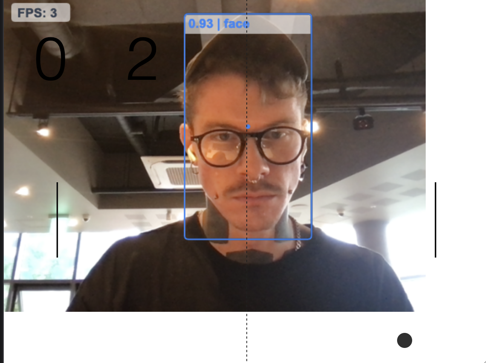

# Handgestures powered gamecontrols

For the purpose of a meetup example, we use [handtrack.js](https://github.com/victordibia/handtrack.js), hook intro the prediction events and use them as game controls.  
This example utilizes webcam input to play the game-classic Pong.

